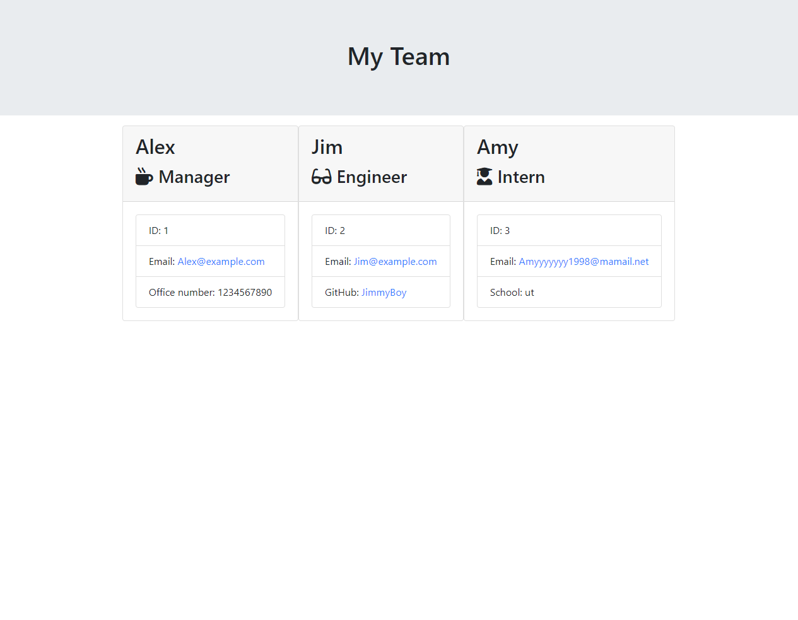

# TeamGenerator

This program will prompt questions about your team then generate a styled html page depends on your input.

## Table of contents
* [Installation instructions](#Installation-instructions)
* [Usages](#Usages)
* [Testing Instructions](#Testing-Instructions)
* [Licenses](#Licenses)
* [Questions](#Questions)

## Installation instructions
Please clone this project, it is not published on npm.

## Usages
node app

Video: https://www.youtube.com/watch?v=AGwnLydVSlM

## Testing Instructions
npm run test

## Licenses
[The Unlicense](https://unlicense.org)

## Questions
* How to contact me?
    * Via [Github](https://github.com/FanghanHu)
    * Via Email: Fanghan.Hu@gmail.com
